# Player Versus Player

    
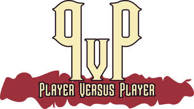

---

    <a href="https://www.kesiev.com/pvp/">Play!</a> 
    <i>Try playing with Firefox Browser and disabling your ad-blocker</i>

---

    
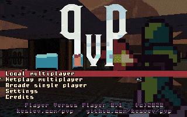

**Player Versus Player** is an opensource web browser 1-4 Players arena shooter you can play offline in split-screen and [networked](#Netplay) _(experimental)_.

    

It tries to catch the aesthetics and accessibility of the early 90s DOS first-person shooters like [Wolfenstein 3D](https://en.wikipedia.org/wiki/Wolfenstein_3D) and [Blake Stone](https://en.wikipedia.org/wiki/Blake_Stone:_Aliens_of_Gold), with a custom [Raycasting](https://en.wikipedia.org/wiki/Ray_casting)-based graphics engine and no vertical aiming...

    
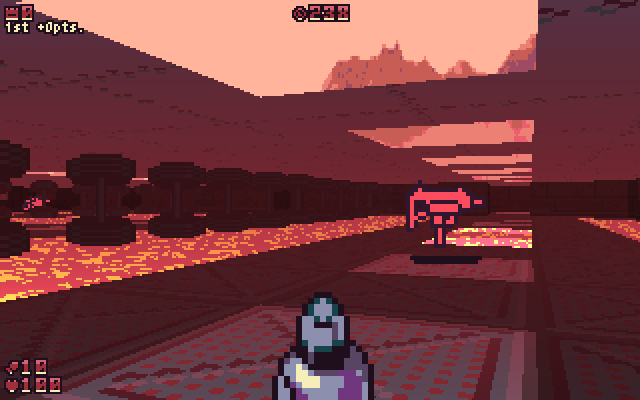

...and pay homage to the great arena shooters of the late 90s, like [Unreal Tournament](https://en.wikipedia.org/wiki/Unreal_Tournament) and [Quake III Arena](https://en.wikipedia.org/wiki/Quake_III_Arena), with fast gameplay and high customizability.

    
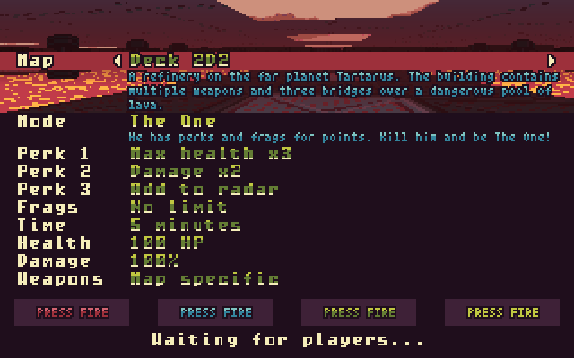

But it also took inspiration from classic arcade games like [Bomberman](https://en.wikipedia.org/wiki/Bomberman) for its gameplay and design: it features simple controls, easy to learn gameplay and every map has a unique mechanic or needs to be played differently.

In PvP, you can play a selection of classic versus and cooperative game modes and an all-new Arcade mode in which you'll go for the highest score surviving 20 random missions alone or together with 3 friends.

And there's even a dark lore for you to discover... Who _truly_ is the _Player Versus Player_?

## Gameplay & Controls

PvP has been thought to be an arena shooter easy enough to be played by anyone but still keeping the game competitive and fun. In PvP, you can just move, aim horizontally, fire, and open doors. There is no way to gain health or keep multiple weapons: don't get hit and keep moving around the map to stay alive and keep firing.

You can use several game controllers to play and all of them can be customized:

| Controller | Move | Aim | Fire | Open doors |
| --- | --- | --- | --- | --- |
| Keyboard | WASD | Strafe holding F | G | H |
| Mouse | WASD | Moving the mouse | Left mouse button | Right mouse button |
| Joypad | Left stick / digital cross | Right stick / Strafe holding Circle | R1 | L1 |
| Touch screen | Swipe on the left half of the screen | Swipe horizontally on the right half of the screen | Swipe up on the right half of the screen | L2 |

Controls are explained once the game is started.

    
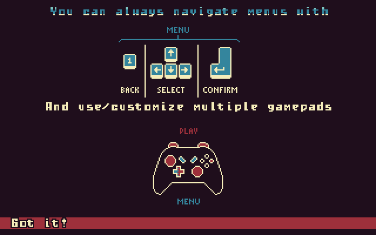

### Controls tips

 * Holding down the _open doors_ button you can slow down your movement and aim. Try using this technique with sniper rifles and guns!
 * If you still want to use a mouse on a touch screen device hit the _Setup_ button when the game page is loaded and set _Mouse_ to the _Screen controls_ options.

## Menu

You can move around menus with the same controllers you use to play.

| Controller | Move | Select | Confirm | Back |
| --- | --- | --- | --- | --- |
| Keyboard | Up / Down | Left / Right | Enter | 1 |
| Mouse | Moving the mouse | Clicking an option | Clicking an option | Clicking the back button on the top left of the screen |
| Joypad | Up / Down on the digital cross | Left / Right on the digital cross | Right menu button | Left menu button |
| Touch screen | Swipe up/down the right half of the screen | Swipe left/right the right half of the screen | R1 | L1 |

### Fullscreen

You can set the game full screen clicking the icon on the top right of the screen with the mouse or hitting L1+R1 on touch screens.

## The radar

In PvP your best ally will be the radar. It's a circular crown in the middle of the screen marking the relative position of key points of the game mode you're playing.

    
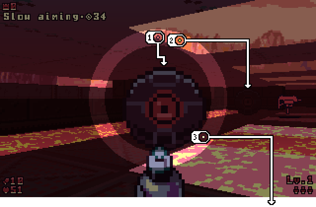

Symbols on the top of the radar (1) are objects in front of you, on the left and right (2) of the radar are on the sides, and on the bottom (3) of the radar are behind you. White symbols (3) indicate far objects, yellow symbols (2) the near ones, and the red symbols (1) objects that are in your proximity. Symbols shape may vary to mark the flag, your base, the hotspot, drones targeting you, etc.

## Netplay

### What's Netplay?

Netplay allows you to play with your friends on multiple devices connected to a network. PvP can work in two different ways, both featuring Netplay:

  * _Standard mode_: you don't need any installation. Just go to the [game page](https://www.kesiev.com/pvp/) and start playing.
  * _Local mode_: you've to [install](#installing) PvP on your local machine or server. This way you can play with friends in the same local network without any internet connection.

In _Standard mode_, you can play with your friends in the same network but playing over the internet is... possible but probably won't work right quite well now. We need a valid TURN server to enable internet play but [we can't afford](#the-cost-of-internet) that right now. We're looking for TURN server donations or any reliable server address to configure but in the meanwhile... I wouldn't rely on that too much. Sorry.

### Setting up your nickname

Anything about playing on a network can be set up from the _Netplay_ menu. From the main menu select the _Settings_ option and then select the _Netplay..._ option.

    
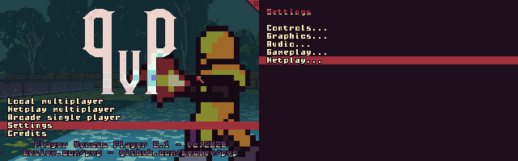

It's the time to choose the nickname you're going to use. Select the _Nickname_ option and type in your battle name.

    
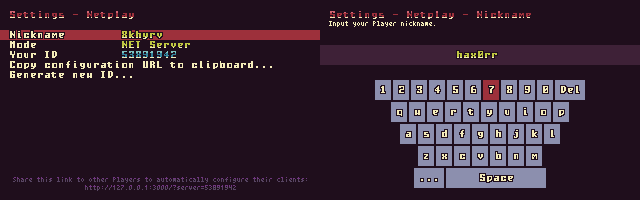

Remember that you can always go back to the previous menu hitting the _back_ button.

### Standard mode

    In order to play in LAN with Chrome you've to go to <i>chrome://flags/</i>, search for <i>Anonymize local IPs exposed by WebRTC</i>. and disable it. Have a look <a target="_blank" href="https://github.com/peers/peerjs/issues/608">here</a> for more.

To play the _Standard mode_ of PvP Netplay just go to the [game page](https://www.kesiev.com/pvp/), hit _Play_, plug some controllers and you're ready to go!

Like in the _old good times_ of LAN parties one of the Players must be the ``server`` and the others the ``clients``. The ``server`` Player has to go to the _Netplay_ menu and select the _NET Server_ mode to see his ID, to be shared with his trusty friends.

    
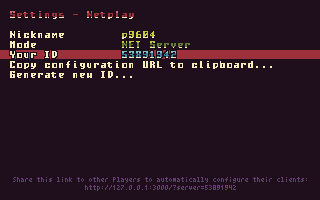

``client`` Players have to go to the same _Netplay_ menu but select the _NET Client_ mode instead. Then select the _NET Server ID_ option and input the Server ID.

    
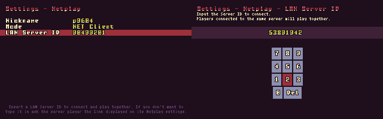

Then all the Players can hit the _Back_ button until the main menu. Select the _Netplay multiplayer_, wait to be connected to the server, and follow the onscreen instructions!

    

#### Tips

The ``server`` Player can share his ID to ``clients`` giving them the URL at the bottom of his _Netplay_ screen. You can automatically copy the link to the clipboard selecting the _Copy configuration URL to clipboard..._ option. Players opening this link will be automatically set to _NET Client_ mode and point to the right Server ID. Just select _Netplay multiplayer_ from the main menu and start playing together!

### Local mode

PvP can be installed on your local computer/server to play it in a local network without any access to the internet. Have a look at the [Installing](#installing) section to learn how to install it.

When playing in _Local mode_ you'll get an extra mode in the _Netplay_ menu. Select the _Socket.io client_ mode and select the _Room_ option to input a room name. Players selecting the same room will play together.

    

Then just go back to the main menu and select _Netplay multiplayer_ to start playing together.

    

#### Tips

Any Player can share his room ID to other Players giving them the URL at the bottom of his _Netplay_ screen. You can automatically copy the link to the clipboard selecting the _Copy configuration URL to clipboard..._ option. Players opening this link will be automatically set to _Socket.io Client_ mode and point to the right Room ID. Just select _Netplay multiplayer_ from the main menu and start playing together!

## Installing

### Standard mode

You don't have to install anything to play PvP both locally and on a network. Just go to the [game page](https://www.kesiev.com/pvp/), hit _Play_, plug some controllers and you're ready to go!

### Self-hosted mode

If for some reason you want to host the game on your web server you need to serve just the ``client`` directory. You'll get a _Standard mode_ copy of PvP.

### Local mode

PvP includes a node.js _local server_ you can use to host the whole game locally and play together in LAN _without using the internet at all_. _*wink wink*_

    
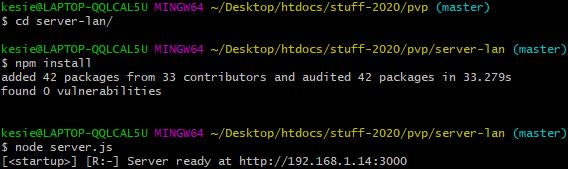

You need node.js ``14.4.0+`` with NPM installed.

  * Download this whole repository
  * With your favorite console go to the ``server-lan`` directory
  * Install the needed packages with ``npm install``
  * Run the server with ``node server.js``
  * A message saying ``Server ready at http://xxx.xxx.xxx.xxx:3000`` should appear
  * Point your and your friends' browser to ``http://xxx.xxx.xxx.xxx:3000``
  * Play!

    
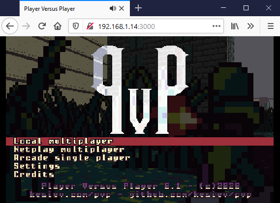

---

## Why this game?

### Arena shooters and split-screen

KesieV and Bianca, now married, used to play Unreal Tournament 2004 with a cross-cable years ago and had fun playing Unreal Tournament 3 on consoles with couch versus and co-op. But the genre radically transformed from those years, becoming a less _intimate_ and more social experience, and split-screen first-person shooters are rare these days.

We decided to bring them back the best we could, simplifying the gameplay to make it playable with parents and friends in the process. That also was a nice opportunity for KesieV to play with raycasters [a little more](https://github.com/kesiev/Wright/tree/master/tapes/woom).

### LAN in late

We knew that networked game _has a slightly different gameplay feeling_ from the split-screen so, after playing the game a lot locally, we felt the _urge_ to try it in LAN so KesieV added networked game using [Socket.io](https://socket.io/). He doesn't think that network features are something you can add at the end in the right way but still... it worked quite well without messing up the code too much. We decided to keep it as an official feature and label it as _experimental_ in the documentation.

Finally, we wanted to play it in LAN anytime without bringing up a server but sadly our hosting plan doesn't support node.js without paying more. The netplay code was already a module plugged to the original game so KesieV decided to write an alternative [WebRTC](https://webrtc.org/) peer-to-peer module using [PeerJS](https://peerjs.com/). WebRTC allows sharing data in real-time on a local network without installing anything on servers and clients and that's just what we needed. But we knew that we could do a little more...

### The cost of Internet

During the early socket.io module development we didn't have enough computers for testing the game with 4 Players so we used [ngrok](https://ngrok.com/) to remotely play with some (very kind and patient) friends. Lag was quite acceptable, even unnoticeable in some tests, so we punched in a TURN server to the WebRTC module to enable internet play... and it worked too! KesieV added some code to reduce the packet exchange and manage the lag effects a little... but keeping a TURN server on is still expensive, so no _official_ Internet play for now.

### But speaking of TURN servers...

...feel free to donate a TURN server for PvP to enable internet play for everyone!

## Hey, I already know a game named PvP!

Sir, you're a legend! This game is formerly _a remake of a fictional game_. In 2016 KesieV started a 4-years game development project called [Wright](https://github.com/kesiev/Wright) in which he explored different game genres (and pop-philosophical themes) writing 100 retro games that never existed. One of them was a 1-on-1 arena shooter with a ZX Spectrum vibe called _Player Versus Player_.

    
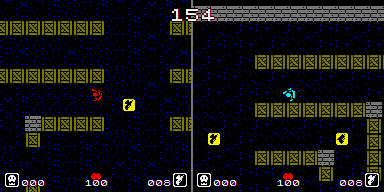

After the game was out KesieV and his colleagues played it a lot during lunch breaks. Some of them used to say that _It should be a first-person shooter!_ It seems like he doesn't forget.

## Why it plays better on Firefox?

The game runs quite smoothly on most modern mobiles and computers but the overall speed seems _capped_ on some laptops using Google Chrome. Moreover, the WebRTC IP Anonymization feature on Chrome may block you from playing PvP in LAN. We suggest you to try using Firefox to play PvP if you're facing one of these problems.

## Is there a kiosk mode?

Yes! You can run the game on Google Chrome via game launchers like [Playnite](https://playnite.link/) with a command like ``<your Chrome path>/chrome.exe -kiosk --autoplay-policy=no-user-gesture-required "<your PVP installation>/client/index.html#kiosk"``. The game will autostart and add a "Quit" option.

## Contacts

As usual, you can contact KesieV on [Twitter](https://twitter.com/kesiev) or using this GitHub project tools.